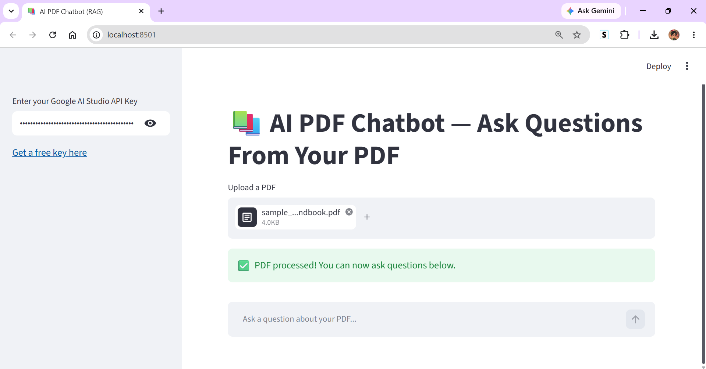
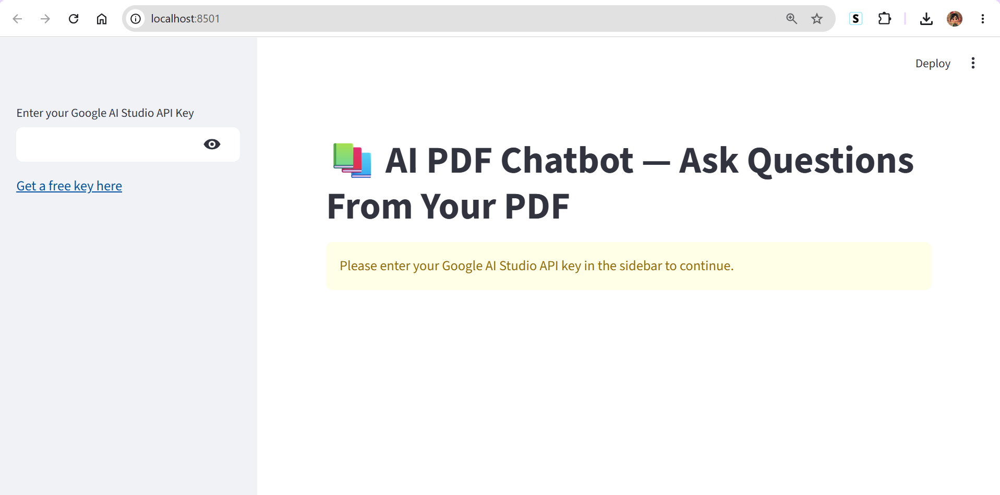
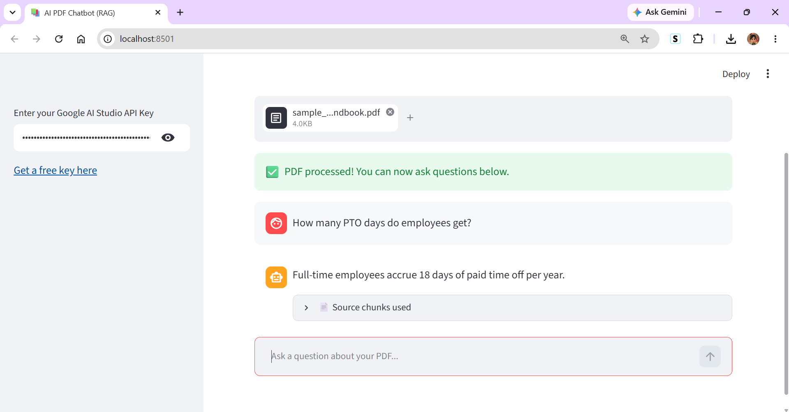

# 📚 AI PDF Chatbot (RAG)
## Screenshots




A Retrieval Augmented Generation (RAG) chatbot that lets you upload a PDF and ask questions about it. Answers are generated by an LLM but grounded in the actual content of your document, with source chunks shown for transparency.

## How It Works

1. **Upload** — A PDF is uploaded through the Streamlit UI.
2. **Chunk** — The document text is split into overlapping chunks using LangChain's `RecursiveCharacterTextSplitter`.
3. **Embed** — Each chunk is converted into a vector using Google's `gemini-embedding-001` embedding model.
4. **Store** — Chunk vectors are stored in a FAISS vector database for fast similarity search.
5. **Retrieve** — When a question is asked, the most relevant chunks are retrieved from FAISS based on semantic similarity.
6. **Generate** — The retrieved chunks are passed to Google's `gemini-2.5-flash` model along with the question, producing an answer grounded in the document.

## Tech Stack

- **Python**
- **Streamlit** — UI
- **LangChain** — RAG pipeline orchestration
- **FAISS** — Vector database
- **Google Gemini API** — Embeddings + LLM generation

## Setup

### 1. Clone the repo
```bash
git clone https://github.com/yourusername/your-repo-name.git
cd your-repo-name
```

### 2. Create a virtual environment
```bash
py -3.11 -m venv venv
venv\Scripts\activate      # Windows
source venv/bin/activate   # macOS/Linux
```

### 3. Install dependencies
```bash
pip install -r requirements.txt
```

### 4. Get a free Google AI Studio API key
Visit [Google AI Studio](https://aistudio.google.com/app/apikey) and generate a free API key.

### 5. Run the app
```bash
streamlit run app.py
```
The app will open in your browser. Paste your API key into the sidebar, upload a PDF, and start asking questions.

> **Note:** Your API key is entered directly in the app's UI and is never stored or hardcoded in the code, so it's safe to use without exposing credentials.

## Project Structure
```
├── app.py              # Main Streamlit app
├── requirements.txt    # Python dependencies
├── .gitignore           # Excludes venv/, .env, etc.
└── README.md
```

## Future Improvements

- Support multiple PDFs at once
- Persist FAISS index to disk to avoid re-indexing on every session
- Add conversational memory for follow-up questions
- Show precise page-level citations
